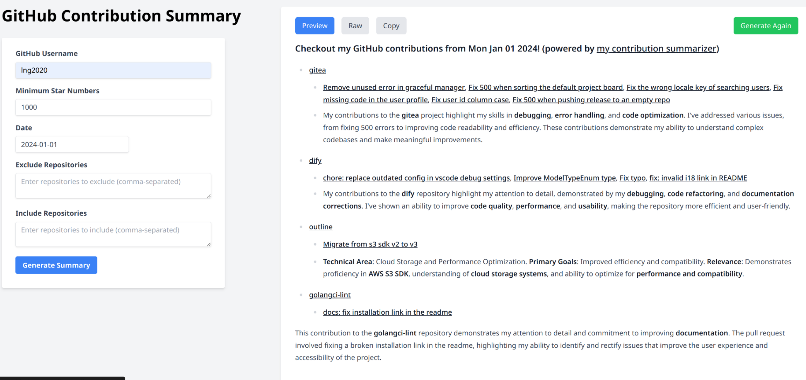
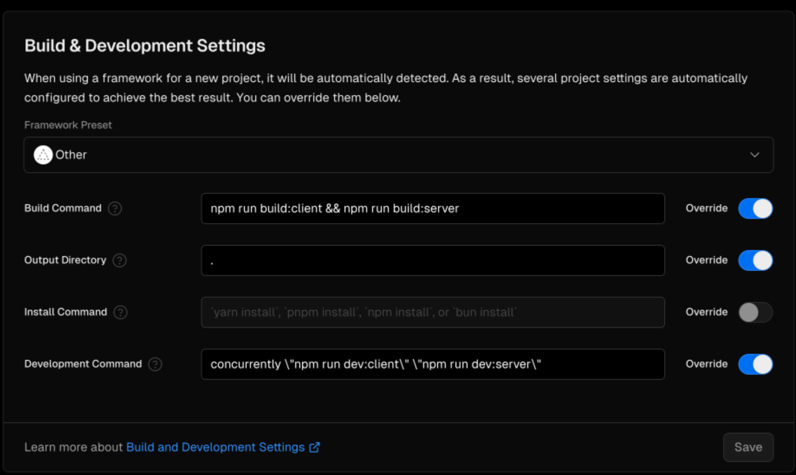

## Summarize your GitHub contributions!

Using GitHub GraphQL API to fetch the contributions and then using AI to summarize the contributions.


## Supported filters

- **username**: GitHub username
- **from**: Start date of contributions
- **type**: Type of contributions (currently only `pull_request`)
- **minumum stars**: Minimum stars of the repositories
- **include**: Include repositories with the given keyword
- **exclude**: Exclude repositories with the given keyword

## Usage

1. setup your env

- `GITHUB_TOKEN`
- `OPENAI_TOKEN`
- `OPENAI_PROXY`: optional

2.

```bash
pnpm install
pnpm run dev
```

## Deploy on your own
[](https://vercel.com/import/project?template=https://github.com/lng2020/contribution-summarizer)

you should change the build settings of the Vercle project to the image below:

## TODO

- [ ] filter enhancements
  - [ ] add more contribution types
  - [ ] add minimun contributions filter
- [ ] API support
- [ ] self-define prompt
- [ ] pagination support
- [ ] (maybe) more LLM summarizers support
- [ ] (maybe) more Git providers support
